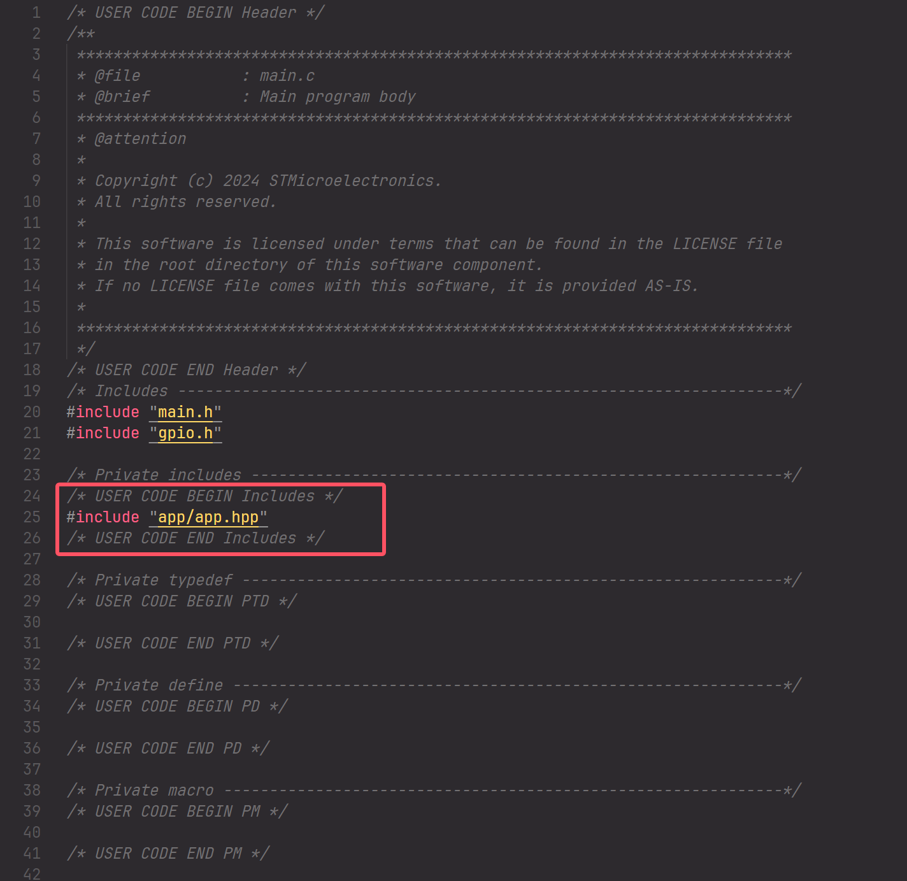

# 基于STM32CubeMX & XMake的现代化嵌入式工作流（支持C++20）

### 项目目录
项目的目录就像这样：

```
-----根目录
    |---bsp （存放CubeMX生成的文件，包括STM32的各种配置）
        |---HAL 
            |--- ...
            |--- ...
            |--- makefile （确保makefile在此目录下）
    |---app （用户代码目录，存放你自己写的逻辑代码）
        |---app.cpp
        |---app.hpp
    |---build （XMake编译后产生的构建文件夹）
        |--- ...
    |---script
        |--- read_hal_makefile.lua （读取makefile的脚本）
    |---xmake.lua （XMake编译选项文件）
```

我们的工作流程是:

使用STM32CubeMX生成代码、配置开发板 -> 写C++/C代码逻辑 -> XMake读取STM32CubeMX生成的makefile，调用gnu-arm工具链编译我们的代码 -> 使用OZone或JLink相关工具烧录

---
# 实现的效果
### 图形化的、简单的引脚配置
> 设置LED对应的引脚为GPIO_output，并给他一个别名（CubeMX会帮你做好所有的初始化工作，你一行代码都不需要写）

> 与繁杂的HAL库分离开来，你可以简单地写C/C++代码

> 一键烧录


---
# 准备工作
### 下载CubeMX IDE
我们需要STM32CubeMX作为我们的代码生成器，帮助我们生成各种繁琐的配置代码。

[点击跳转: STM32CubeMX官网](https://www.st.com.cn/zh/development-tools/stm32cubemx.html)


推荐6.12.0版本
### 下载VSCode作为我们的代码编辑器
[点击跳转: VSCode官网](https://code.visualstudio.com/)
### 下载安装XMake作为我们的构建工具

[下载链接(windows)](https://github.com/xmake-io/xmake/releases/download/v2.9.6/xmake-v2.9.6.win64.exe)

或者你也可以根据你的系统自选下载：
[XMake-github](https://github.com/xmake-io/xmake/releases/tag/v2.9.6)

### 安装gnu-arm工具链

在vscode的插件商店搜索```EIDE```，然后安装

完成后，找到左边的EIDE图标，按图指示安装这两个工具


# 开始开发

### STM32CubeMX的配置
- 注意：遇到让你下载的弹框一定要选择下载

打开我们的STM32CubeMX，选择MCU型号

我们使用F103C8T6

配置Debug模式方便烧录和调试

配置外部时钟以方便我们使用更高频率

Clock Configuration里就可以改成72MHZ了（遇到弹框OK即可）

ProjectManager里面我们设置成生成Makefile，项目名自定，路径随便（我们待会还要改）


先点个LED吧！

我的芯片LED引脚是PB2,这里我选择PB2将其改成GPIO_Output模式

右键它给他起个名字（这样在代码里也可以使用）

先生成代码

找到生成代码的文件夹，我们需要复制.ioc这个文件，其余的都删除

将其复制到 ```你的项目目录/bsp/HAL/``` 下，然后双击打开

这回再生成代码，路径就是对的了


### XMake的配置
VSCode进入xmake.lua所在目录(即项目根目录)，输入

```xmake f --sdk="你的gnu-arm工具链目录"``` 

一般eide安装的默认在“用户”文件夹下的.eide文件夹里，就像这样：

这样证明已经配置成功，我们可以开始写代码了！

### 写代码

我们在 app 文件夹下存放我们的代码逻辑

- app.hpp (这样写可以让我们在只支持C语言的开发板上写C++)
    ``` c++
    #pragma once 

    #ifdef __cplusplus
    extern "C" {
    #endif
    void entrypoint();
    #ifdef __cplusplus
    }
    #endif
    ```
- app.cpp
    ``` c++
    #include <main.h> //这里包含上我们STM32CubeMX生成的main.c主函数
    #include "app/app.hpp"

    void entrypoint() {
        // 这里写主逻辑
        while (true) {
            HAL_GPIO_TogglePin(LED_GPIO_Port, LED_Pin);
            HAL_Delay(200);
        }
    }
    ```

回到 ```main.c``` 文件 （```项目目录\bsp\HAL\Core\Src\main.c```）

把我们写的entrypoint函数放进去（注意添加在所有初始化函数完成之后）

包含进我们的 ```app.hpp```


最后在根目录执行 ```xmake```


大功告成！


build下就生成了可以烧录的elf文件

### 如果用OZone烧录


